 
 

  <h1>Internet forum</h1> 

 
 
 

  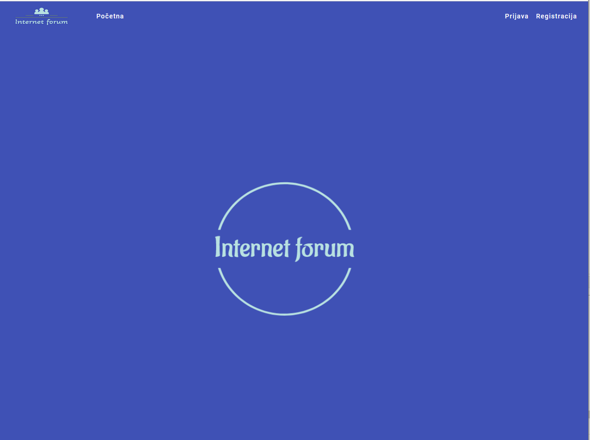

## README fajl u fazi obrade

<table>
  <tr>
    <td><b>Prijava na sistem</b></td>
    <td><b>Verifikacija</b></td>
  </tr>
  <tr>
    <td>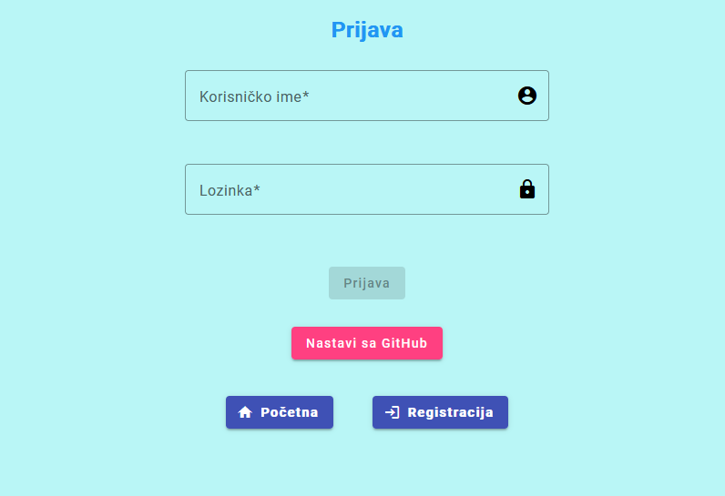</td>
    <td>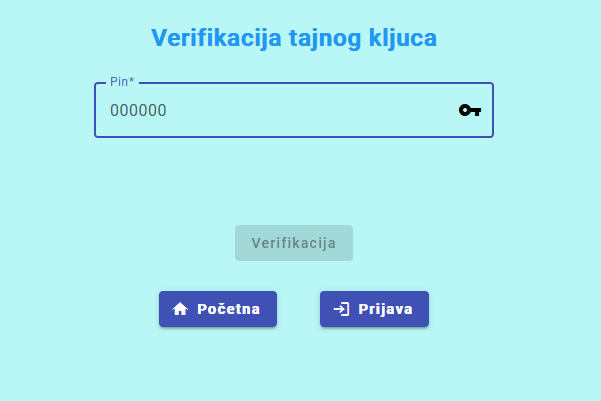</td>
  </tr>
  <tr>
    <td><b>Verifikacija</b></td>
    <td><b>Registracija</b></td>
  </tr>
  <tr>
    <td>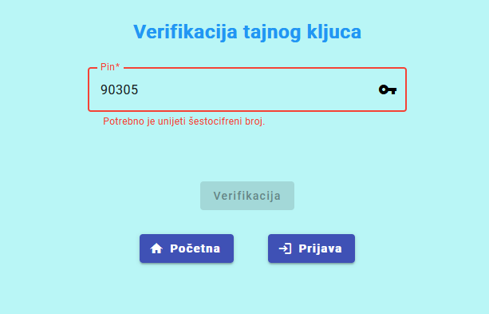</td>
    <td>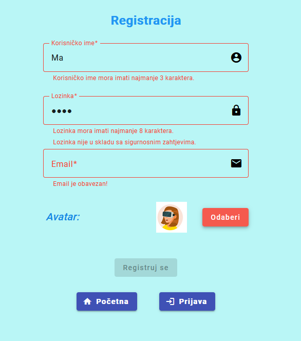</td>
  </tr>
    <tr>
    <td><b>Teme</b></td>
    <td><b>Forum</b></td>
  </tr>
  <tr>
    <td>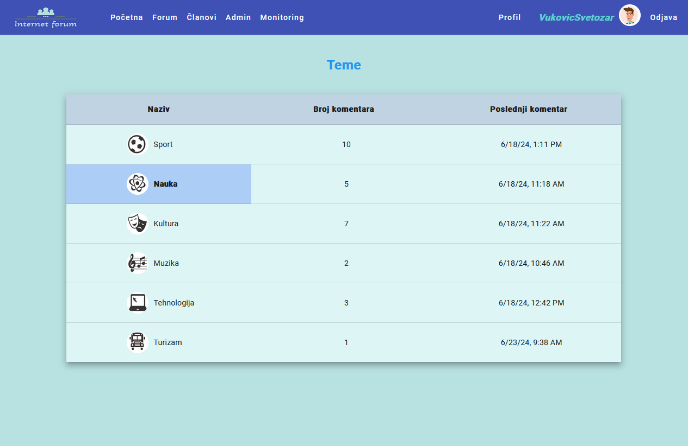</td>
    <td>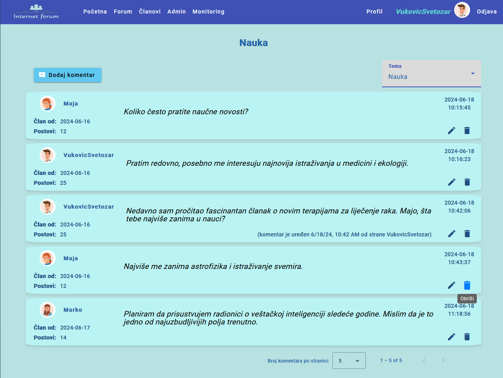</td>
  </tr>
  <tr>
    <td><b>Lista korisnika</b></td>
    <td><b>Panel administratora</b></td>
  </tr>
  <tr>
    <td>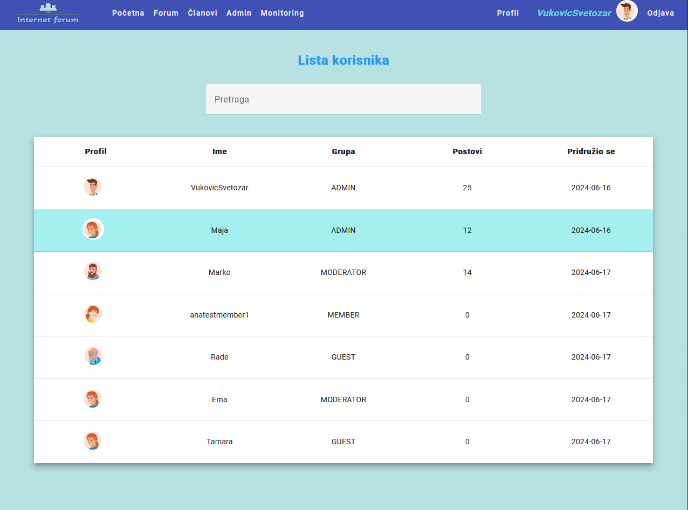</td>
    <td>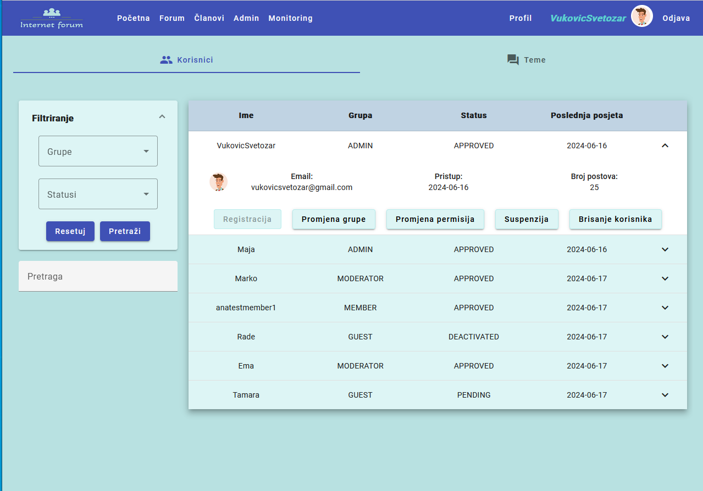</td>
  </tr>
    <tr>
    <td><b>Promjena permisija</b></td>
    <td><b>Suspenzija korisnika</b></td>
  </tr>
  <tr>
    <td>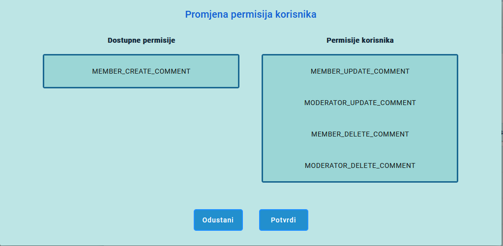</td>
    <td>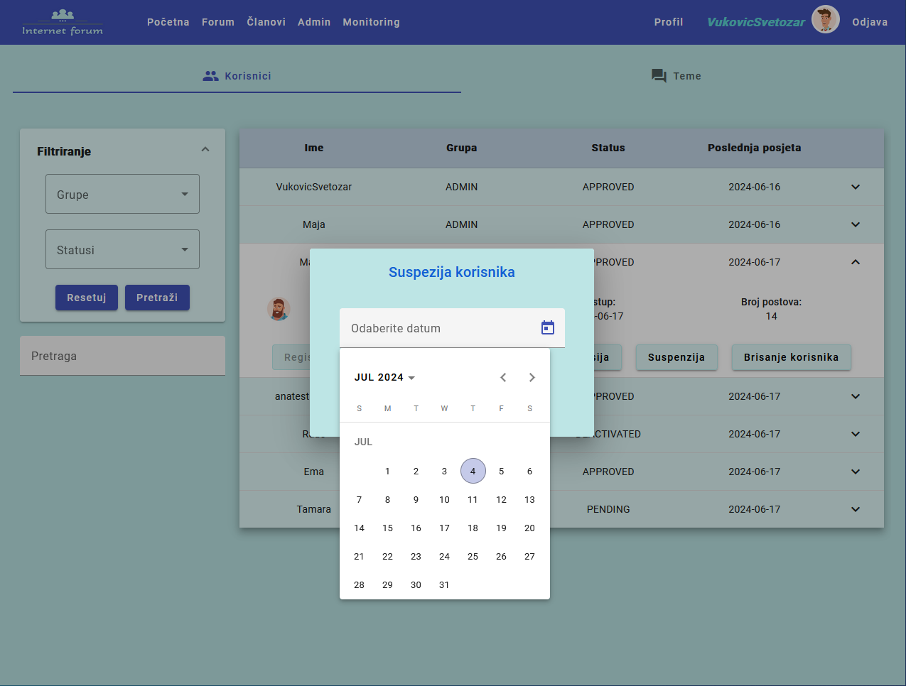</td>
  </tr>
  <tr>
    <td><b>Dodavanje teme</b></td>
    <td><b>Greške</b></td>
  </tr>
  <tr>
    <td>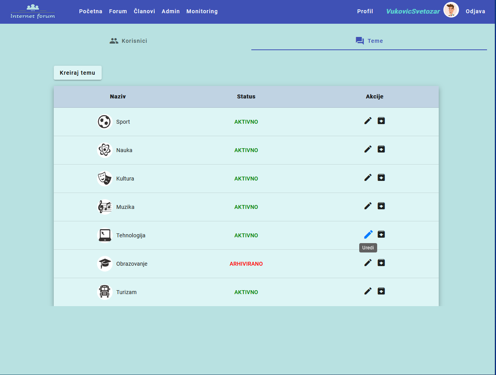</td>
    <td>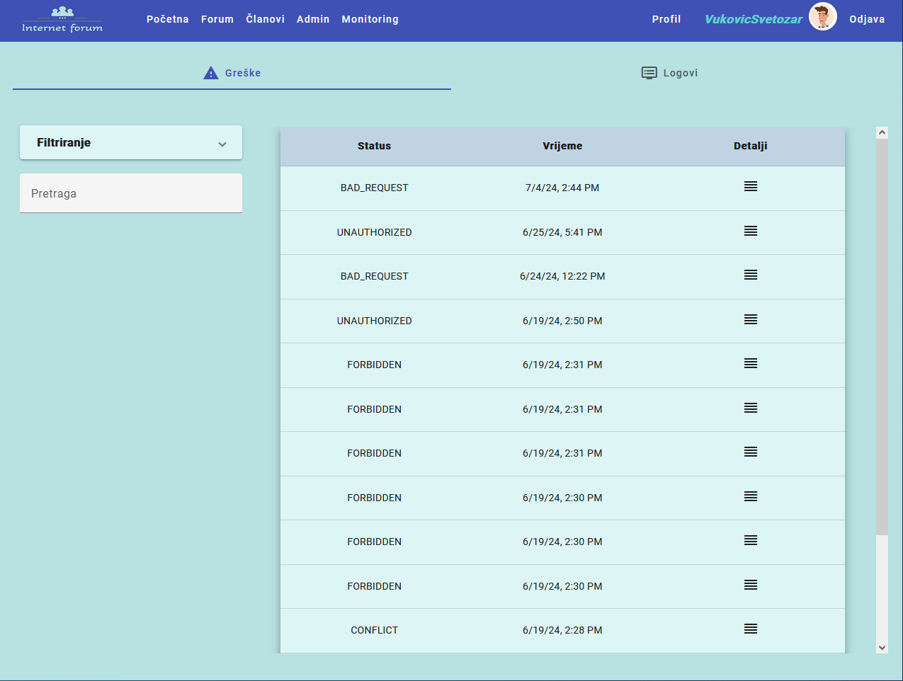</td>
  </tr>
    <tr>
    <td><b>Upozorenja</b></td>
    <td><b>Logovi</b></td>
  </tr>
  <tr>
    <td>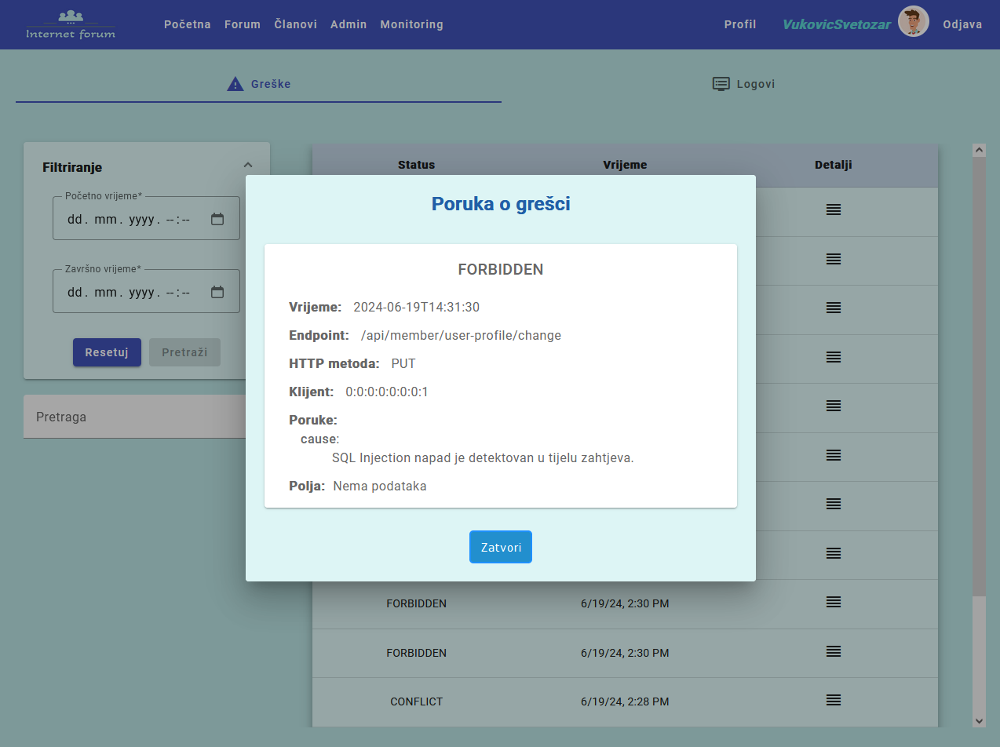</td>
    <td>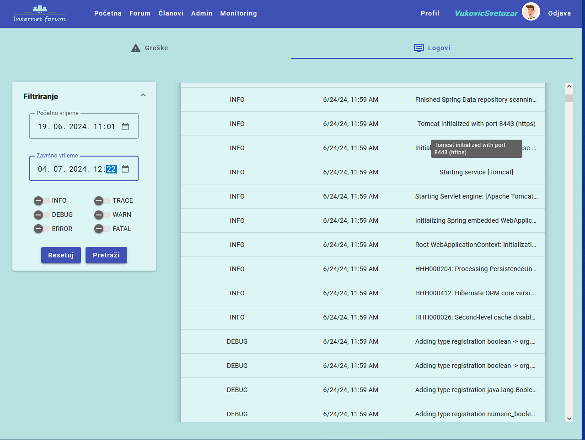</td>
  </tr>
  <tr>
    <td><b>Ažuriranje korisnika</b></td>
    <td><b>Ažuriranje korisnika</b></td>
  </tr>
  <tr>
    <td>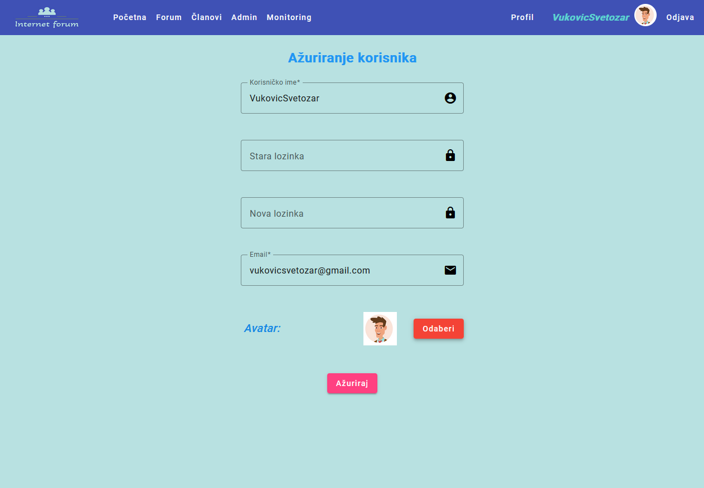</td>
    <td>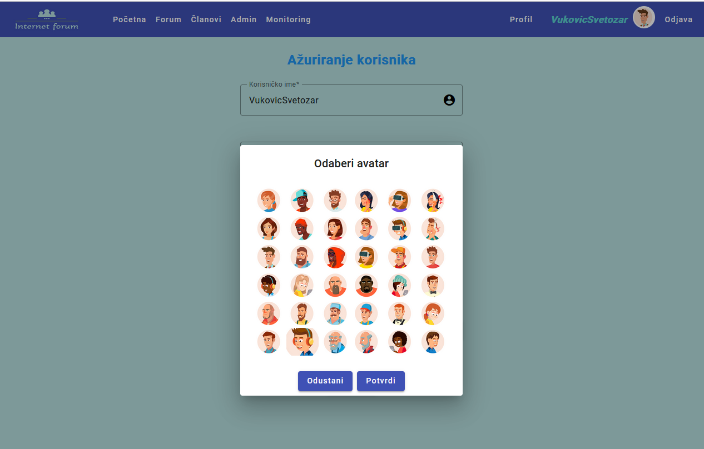</td>
  </tr>
</table>
